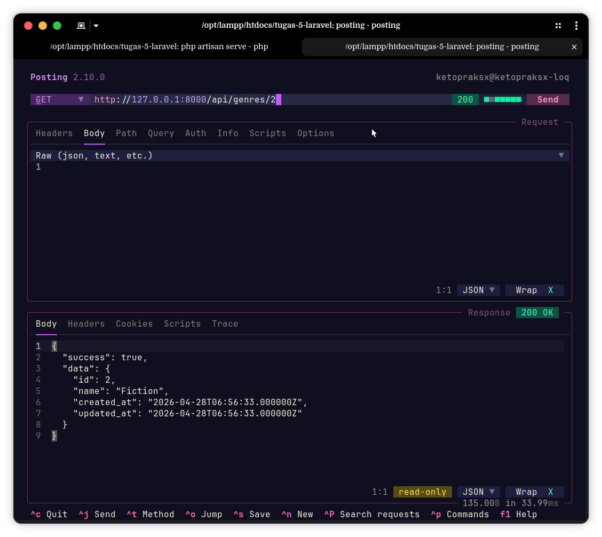
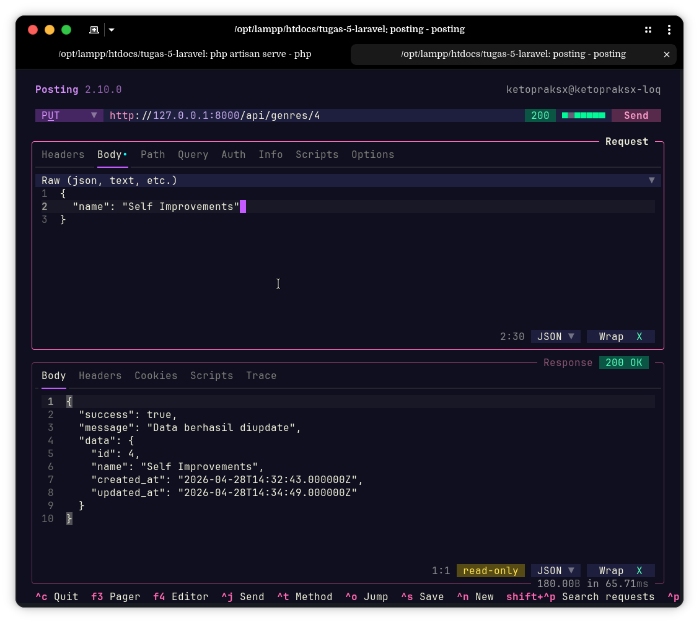
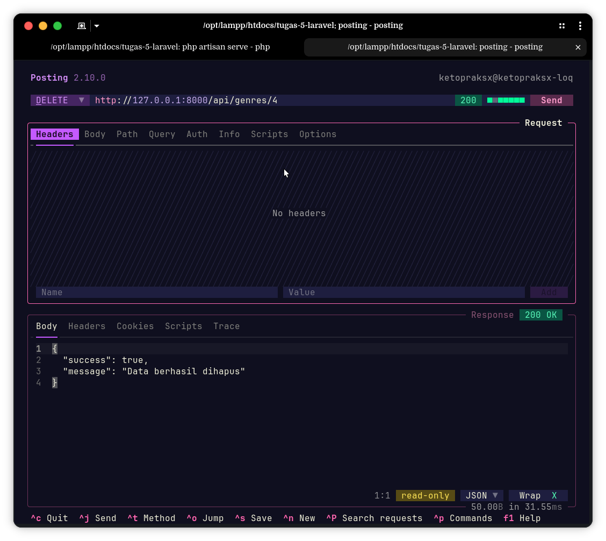
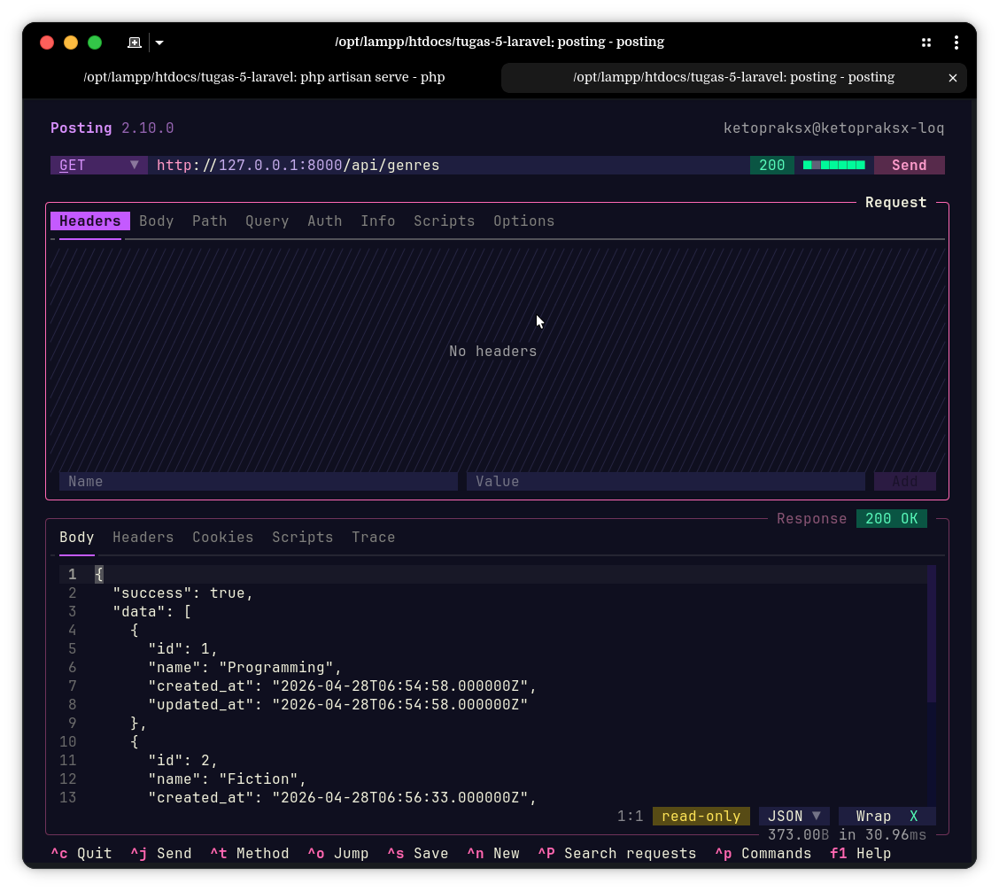
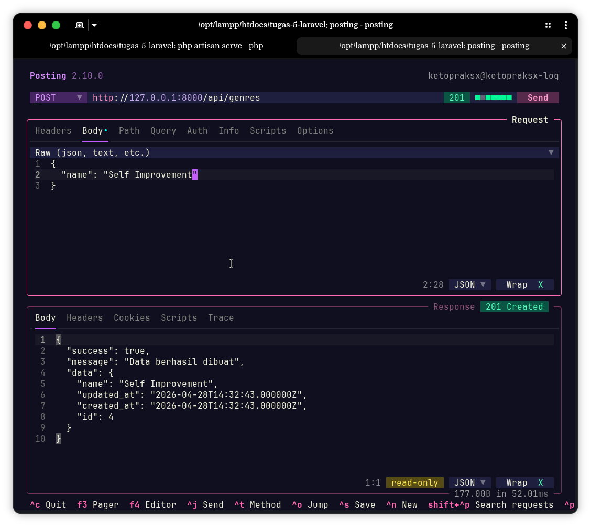

# Tugas Laravel: Rest API Resource (Genre & Author)

Tugas ini merupakan pengembangan dari API sebelumnya, dengan mengimplementasikan fitur lengkap CRUD (Create, Read, Update, Delete) menggunakan `apiResource` dan validasi error handling.

## 🚀 Fitur Baru
- **Show**: Mengambil detail satu data berdasarkan ID.
- **Update**: Memperbarui data yang sudah ada berdasarkan ID (Method PUT).
- **Destroy**: Menghapus data dari database berdasarkan ID (Method DELETE).
- **Validation**: Handling error 404 jika data yang dicari tidak ditemukan.
- **Efficient Routing**: Menggunakan `Route::apiResource` untuk kode yang lebih clean.

## 🛠️ Tech Stack
- **Framework:** Laravel 13
- **Database:** MySQL
- **Tools:** Posting (API Testing)

## 📂 Struktur Controller
- `app/Http/Controllers/Api/GenreController.php`
- `app/Http/Controllers/Api/AuthorController.php`

---

## 🛰️ API Endpoints (apiResource)

| Method | Endpoint | Fungsi |
| :--- | :--- | :--- |
| GET | `/api/genres` | Read All Data |
| POST | `/api/genres` | Create Data |
| GET | `/api/genres/{id}` | Show Detail Data |
| PUT | `/api/genres/{id}` | Update Data |
| DELETE | `/api/genres/{id}` | Destroy Data |

*Sama halnya dengan endpoint `/api/authors`.*

---

## 📸 Dokumentasi Testing (Postman)

### 1. Fitur Show (Detail Data)
- **Success:** 

### 2. Fitur Update
- 

### 3. Fitur Destroy (Delete)
- 

### 4. Fitur GET
- 

### 5. Fitur POST
- 

---

## ⚙️ Cara Instalasi
1. Clone repository ini.
2. Jalankan `composer install`.
3. Sesuaikan konfigurasi database di file `.env`.
4. Jalankan migrasi: `php artisan migrate`.
5. Jalankan server: `php artisan serve`.